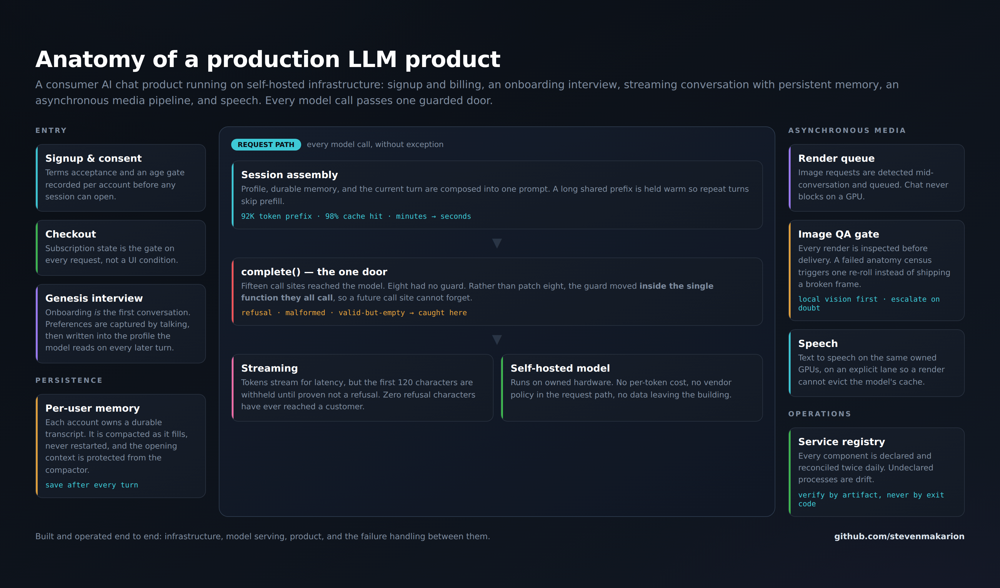
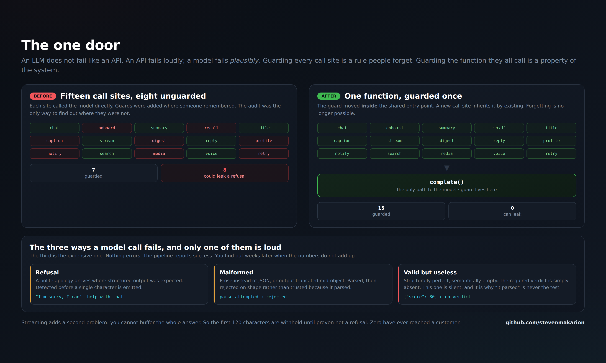
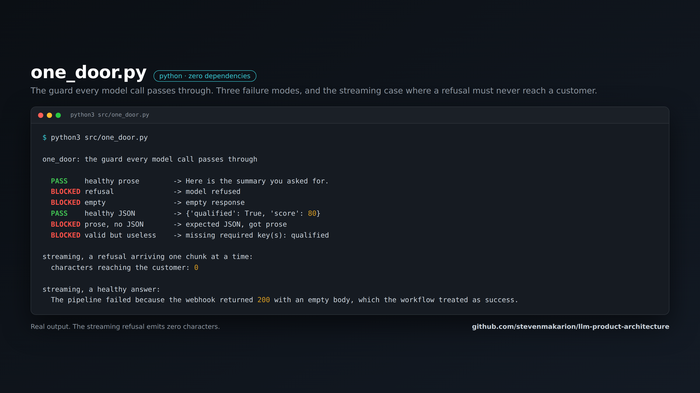

# Anatomy of a production LLM product

What it actually takes to run a consumer AI product on your own hardware: signup and billing,
onboarding that happens as a conversation, streaming chat with durable per-user memory, an
asynchronous media pipeline, speech, and the failure handling between all of it.

Written from a system in production, not from a tutorial.



---

## The part almost nobody builds

Most writing about LLM products covers the happy path: prompt in, tokens out, ship it. The
happy path is the easy third. The system is defined by what it does when the model returns
something wrong, and a model returns something wrong in three ways, only one of which is loud.

| Failure | What it looks like | Loud? |
|---|---|---|
| **Refusal** | a polite apology where structured output belonged | yes |
| **Malformed** | prose instead of JSON, or a truncated object | yes |
| **Valid but useless** | parses perfectly, means nothing, the required field simply absent | **no** |

The third one is the expensive one. Nothing errors. The pipeline reports success. Every
dashboard stays green, and you find out weeks later when the numbers do not reconcile.

That is why **"it parsed" is never the test.**

---

## The one door



A refusal once reached a paying customer. Not a crash and not a 500: the model declined, and
the product rendered the decline as though it were the answer.

The obvious fix is to guard the call site that leaked. That fix is wrong in an instructive
way, because it repairs the instance and leaves the class. So instead of patching the leak,
we counted the doors.

**Fifteen places called the model. Eight had no guard.**

Nobody had been careless. The guards had been added wherever somebody happened to remember,
which is what "remember to guard it" always decays into.

So the guard moved **inside the single function all fifteen called.** A new call site now
inherits protection by existing.

> Guarding every call site is a rule people forget.
> Guarding the function they all call is a property of the system.

The working implementation is [`src/one_door.py`](src/one_door.py). Zero dependencies, and it
runs:



```
BLOCKED refusal              -> model refused
BLOCKED empty                -> empty response
BLOCKED prose, no JSON       -> expected JSON, got prose
BLOCKED valid but useless    -> missing required key(s): qualified

streaming, a refusal arriving one chunk at a time:
  characters reaching the customer: 0
```

---

## Streaming makes it harder

You cannot inspect an answer you have not finished receiving. Buffering the whole response to
check it throws away the exact latency you streamed for.

The resolution is a **held prefix**: emit nothing until enough characters exist to classify,
then release and pass through freely. In production that threshold is **120 characters**.

The cost is a few dozen characters of delay, imperceptible to a reader. The benefit is that a
refusal can never be rendered, because it is recognisable long before 120 characters have
arrived.

---

## Onboarding as a conversation

The signup flow does not end at a form. The account's first session **is** the onboarding: the
product asks, the person answers in their own words, and what they say is written into a
profile the model reads on every later turn.

Two things fall out of that. The first turn is already valuable rather than a setup tax. And
the profile is prose written by the user, not enum values chosen from a dropdown, which is a
far better prompt than any structured form produces.

---

## Memory that is not a chat log

Each account owns a durable transcript that is **saved after every single turn**, not at
session end, so a dropped connection loses nothing.

When it fills, it is **compacted, never restarted** — summarised forward with the opening
context explicitly protected from the compactor, because the opening is what establishes who
the assistant is. Compacting that away produces a subtly different product on day thirty than
on day one, and users feel it before they can name it.

One hard-won detail: the process holds the transcript in memory and writes it back. If another
process (a migration, a restore) writes that file meanwhile, the in-memory copy will happily
overwrite it. So the file's modification time is checked before every turn, and a newer copy on
disk always wins.

---

## Asynchronous media

Image generation takes seconds to minutes. Chat cannot wait on a GPU.

Requests are detected mid-conversation and queued, and the conversation continues. Every
render passes a **QA gate** before delivery: an anatomy census that fails a bad frame and
triggers one re-roll instead of shipping it. Local vision runs first because it is free, and
escalates to a stronger model when the cheap one is uncertain.

Speech runs on the same owned GPUs on an **explicit lane**, so a render cannot evict the
language model's cache. Before the lanes were explicit, a heavy image job would silently make
the next chat turn take minutes, with nothing in any log to explain it.

---

## Why self-hosted

- **No per-token cost.** Usage-based pricing on a conversational product means your most
  engaged users are your least profitable ones.
- **No vendor policy in the request path.** A provider's refusal behaviour becomes your
  product's behaviour, and it can change without notice.
- **The data does not leave the building.**

The tradeoff is real and it is operational: you now own uptime, model updates, GPU contention,
and cache warmth. That is a systems job, not a prompt job. The measured numbers behind running
it are in [local-llm-deploy](https://github.com/stevenmakarion/local-llm-deploy), and the
service discipline that keeps it standing is in
[service-estate](https://github.com/stevenmakarion/service-estate).

---

## What this repo is

A case study with the working guard included, published because the failure-handling layer is
the part that is almost never written down, and it is the part that decides whether an AI
product is a demo or a business.

Built and operated end to end: infrastructure, model serving, product, and the seams between.

MIT licensed.
